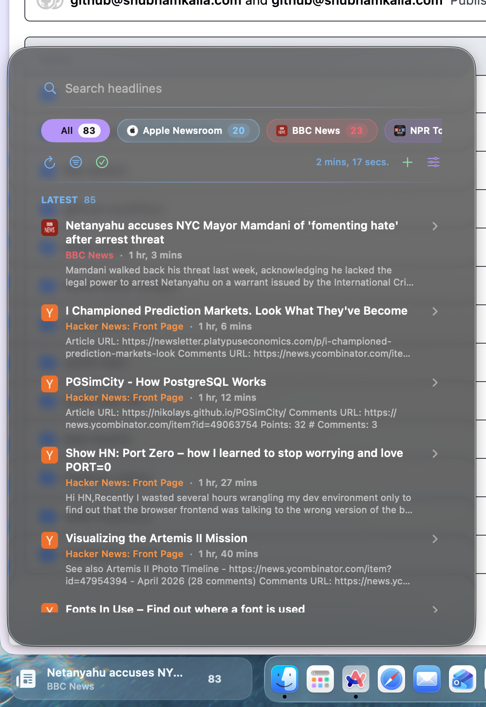

# News Reader Dock Widget

> This extension was created with help from AI and reviewed by a human.



An API 3 Vehla Dock Widget with compact, inline, and popup surfaces.
It fetches RSS and Atom feeds on a background utility queue, stream-parses large
podcast feeds (early-exit after N items), caches feed artwork, tracks unread
state, and opens articles through the host.

## Features

- Article detail pane (expand in place: Open / Copy / Mark read)
- Favicon and podcast artwork cache
- Per-feed refresh intervals and mute
- OPML import / export from Manage Feeds
- Starter feeds on first launch

Compact and inline surfaces stay white; the popup uses per-feed accent colors.

## Build

```sh
cd extensions/news-dock-widget
./build.sh
```

The signed bundle is written to:

```text
bin/NewsDockWidget.bundle
```

## Install

Build the extension, then install the `news-dock-widget` package through Vehla's
local extension installation flow. Keep `extension.json` beside the `bin`
directory so Vehla can resolve its `bin/NewsDockWidget.bundle` entrypoint.
